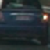
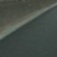
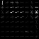
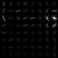
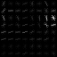
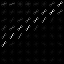
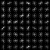
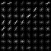

## Vehicle Detection Project

[//]: # (Image References)
[image1]: ./output_images/1_car_img.jpg
[image2]: ./output_images/2_non_car_img.jpg
[image3]: ./output_images/3_car_color_converted_img.jpg
[image4]: ./output_images/4_not_car_color_converted_img.jpg
[image5_1]: ./output_images/5_1_car_hog_channel_0_img.jpg
[image5_2]: ./output_images/5_2_car_hog_channel_1_img.jpg
[image5_3]: ./output_images/5_3_car_hog_channel_2_img.jpg
[image6_1]: ./output_images/6_1_not_car_hog_channel_0_img.jpg
[image6_2]: ./output_images/6_2_not_car_hog_channel_1_img.jpg
[image6_3]: ./output_images/6_3_not_car_hog_channel_2_img.jpg
[image7]: ./output_images/7_all_scales.jpg
[image8]: ./output_images/8_heatmap.jpg
[image9]: ./output_images/9_labels.jpg
[image10]: ./output_images/10_window_img.jpg

[video1]: ./project_video_output.mp4

To detect vehicles inside a video stream, following are the steps I implemented:
1. Calculate Histogram of Oriented Gradients (HOG) features for a frame.
2. Also calculated were the color histogram features and RGB binary features.
3. I then used training dataset consisting of images of vehicles and non-vehicles and extracted all features from them.
4. Then I used a linear SVM classifier to train classifier to determine if a car is present in an image or not.
5. Next, I implemented a sliding window search technique on video stream frames to identify if car is present in that window of frame.
6. Then a heatmap of all the detections were created, which gave an estimated bounding box of the vehicle in video frame.

All of the code for this project is located in IPython notebook 'Vehicle_detection_tracking.ipynb'.

### Histogram of Oriented Gradients (HOG)

The code for calculating the HOG features is located in cell 7 of the notebook. I then wrapped this method to inside another method called `single_image_feature` located in cell 8. This method just extracts and concatenates all the features for a particular image. This method was itself wrapped inside another method called `extract_features`, which takes in a list of images and returns feature for all those images.

To calculate hog features I used the `skimage.feature.hog` method with different parameters.

I then loaded all the training images into two feature vectors `car_features` and `not_car_features` by using the above `extract_features` method. The code is located in cell 13 of the IPython notebook. These two feature vectors contains hog features in addition to color and spatial features of the image.

Here is an example of one of each of the `vehicle` and `non-vehicle` classes:

Vehicle Image

Non-Vehicle Image

I then explored different color spaces and different `skimage.hog()` parameters (`orientations`, `pixels_per_cell`, and `cells_per_block`).  I grabbed random images from each of the two classes and displayed them to get a feel for what the `skimage.hog()` output looks like.

Here is an example using the `YCrCb` color space and HOG parameters of `orientations=8`, `pixels_per_cell=(8, 8)` and `cells_per_block=(2, 2)`:

###### Vehicle Images

YCrCb channel Image

HOG Channel-1 Image

HOG Channel-2 Image

HOG Channel-3 Image

###### Non-Vehicle Images

YCrCb channel Image

HOG Channel-1 Image

HOG Channel-2 Image

HOG Channel-3 Image

I experimented with different color spaces and orientations and pixels per cell.

Increasing the orientations from existing 9 to 12 increased the number of features to train but did not improve upon the accuracy of the classifier. Hence, I then kept number of orientation to be used with hog as 9.

Increasing the number of cells per block from 8 to 12 or 16 exponentially decreased the number of features to be trained on. Due to this the accuracy of SVM decreased from 0.98 to 0.93 which was a big decrease. While decreasing the number of pixels per cell from 8 to 4 increased the features from 6108 to 25116 which is almost 4x increase. This resulted for SVM to take a lot of time on single image to classify and thus reducing the efficiency of the algorithm.

The final features for extracting the images are:
Number of orientations = 9
Number of pixels per cell = 8
Number of cells per block = 2

### Training a classifier
I used a Linear Support Vector Machine (LinearSVC) from sklearn library to train on training features extracted above.

The code for training is located in cell 15 titled 'Train a classifier on vehicle dataset'.

I had split the data for training into training and testing set, with testing set having 20% of the total data and remaining images were in training set.

The SVM took 24.02 seconds to process car and non-car features with each image having 6108 features. This produced an accuracy of 0.9887 on testing dataset.

### Sliding Window Search
The code for sliding window search is in cells 17 and 18. I used the HOG sub-sampling approach to identify vehicles in images.

In this approach I calculate the HOG features for the entire image once and used a scaling factor to scale the image to that dimension. Then I calculated number of virtual windows present by using the number of pixels per cell and cells per block parameters of HOG features.

I used different scales for searching of vehicles. Instead of creating varying window sizes, I manipulated image scale to decrease or increase the size of image with a fixed window size of (64, 64). The scale size I used were in increments of 0.25 in range [1, 2].

Ultimately I searched on 5 different scales [1, 1.25, 1.5, 1.75, 2] using YCrCb 3-channel HOG features plus spatially binned color and histograms of color in the feature vector, which provided a nice result.  

Here is an example of image with different scales of window drawn:

![alt text][image7]
---

### Video Implementation

Here's a [link to my video result](./project_video.mp4)

For capturing vehicles in video frames, I kept record of bounding boxes in a list for an image, which the classifier predicted to be as car. Using all the bounding boxes for single image, I created a heatmap by adding a value of 1 for each pixel in each bounding box. I then thresholded that map to identify vehicles and remove false positives.

I then used `scipy.ndimage.measurements.label()` to identify individual blobs in the heatmap. This method returned the number of vehicles or blob in the image and a tight bounding box consisting of that blob. I then assumed each blob corresponded to a vehicle.  

The tight bounding box was then drawn on the video frame to indicate that a vehicle is detected.

The code for detecting false positives is located in cell 19, 20 and 21.

Here's an example result showing the heatmap from a series of frames of video, the result of `scipy.ndimage.measurements.label()` and the bounding boxes then overlaid on the last frame of video:

Below is the image showing heatmap for above image with all bounding boxes:

![alt text][image8]

And below is the output of `scipy.ndimage.measurements.label()` on the generated heatmap from all window scales:

![alt text][image9]

### Here is the resulting final bounding box drawn on the frame:

![alt text][image10]

---

### Discussion

The problem I faced initially was to get a good balance of number of features required to train and correctly predict the vehicle versus the time required to run the algorithm for a single image.

The algorithm will likely fail in scenarios where the car features doesn't match with the features in training dataset. Another object looking similar to car maybe incorrectly detected as car where it might not be present.

Another area where it might fail is the area where front of the car is there. Since it is not trained for frontal car, the algorithm will surely fail for cars coming from the other side of the road.

Another area of improvement would be the speed in determining and classifying vehicles in images. The present algorithm takes 1-2 seconds to process an image which is not feasible in real-time environment where many cars are observed on the road. An advanced algorithm which keeps track of vehicle position from previous frames would perform slightly faster than the present algorithm.

### References
1. The project walkthrough provided by Udacity helped me a lot in understanding how to approach the problem and gave pointers of how to implement HOG sub-sampling search.
https://www.youtube.com/watch?v=P2zwrTM8ueA&list=PLAwxTw4SYaPkz3HerxrHlu1Seq8ZA7-5P&index=5
